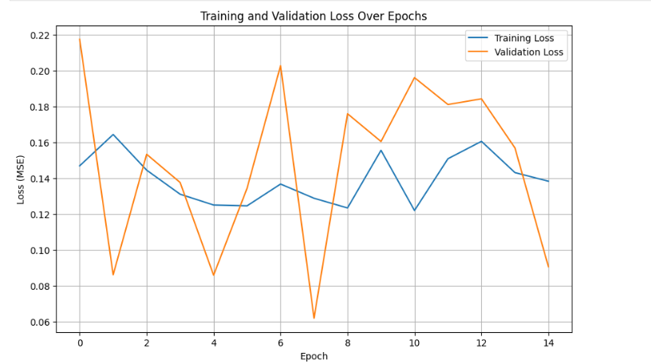

## Abstract
This paper addresses the challenge of adapting large text-to-image diffusion models for niche artistic style transfer, a task where a direct comparison of leading Parameter-Efficient Fine-Tuning (PEFT) methods is under-explored. The central issue investigated is the comparative efficacy of Low-Rank Adaptation (LoRA) and Textual Inversion (TI) for this purpose. The paper is structured to first detail the implementation of both PEFT methods, followed by a comparative evaluation. The methodology employs both quantitative analysis; assessing training efficiency, loss dynamics, CLIP, and FID scores and a qualitative user study evaluating aesthetic appeal and content preservation. The results demonstrate that LoRA achieves superior performance across all metrics. It exhibited more stable training dynamics, avoiding the overfitting observed in the Textual Inversion process, and attained better quantitative scores for image fidelity and prompt alignment. Furthermore, a blind user study revealed an overwhelming preference (90%) for LoRA-generated images. The paper concludes that LoRA is the more effective, precise, and robust methodology for high-fidelity style transfer under data-constrained conditions.

# Research Question
This leads to the focal research question that is, how do LoRA and TI compare in their efficacy, efficiency and precision in reproducing a niche image style using a pre-trained SD model that has been trained on a limited dataset? 

# Data Curation
115 landmark images from the Google Landmarks Dataset V2 were selected to ensure global diversity in architecture, scale and composition. This dataset is designed for fine-grained visual localization and contains real-world photographic variations such as landscape images or aerial view images, making it well suited as the base for stylization.
The 115 source landmark images were processed using the Stable Diffusion WEBUI, a popular open-source interface for the stable diffusion model. Using the img2img functionality, each image was re-rendered into a “Ghibli” style image using a text prompt that guided the model.

A critical component of the synthetic data generation phase was careful crafting of text prompts. For each image, a unique prompt was created and saved to a text file. The prompts followed a structured template:

             <name of landmark> <location> <description> <description of composition>

Image transformation for the suitable dataset is a crucial step. There are 3 transformations applied to each of the source image:
•	Resolution Standardization: This step resizes each image to 512*512 pixels. This is essential because neural networks require fixed-size inputs.
•	Centre Cropping: This function performs a crop to fit the target aspect ratio before resizing. This ensures that the most salient, central part of the landmark is preserved while potentially distracting or irrelevant border elements are removed.
•	High-Quality Resampling: The Lanczos filter is widely regarded as providing a superior trade-off between sharpness and reduction of aliasing artifacts making it an excellent choice for downscaling photographic images while preserving details.

# Low-Rank Adaptation (LoRA)
LoRA is a popular PEFT technique which is designed to efficiently adapt to large machine learning models to newer contexts. Its mechanism operates by isolating the original pre-trained model weights and parameters and by introducing trainable rank decomposition matrices, typically referred to as A and B, into selected layers of the model. The full weight update that occurs during a traditional fine-tuning stage is approximates based on the product of these two low-rank matrices.
This PEFT method significantly reduced the number of trainable parameters, for instance, it can reduce the trainable parameters for a GPT-3 model from 175 billion to approximately 18 million which leads to reduced utilization of GPU resources by estimated 66%. This in turns makes the training process efficient and fast while also lowering the hardware bottleneck for fine-tuning.

The training process for the LoRA model was configured to run for 10 epochs. The training log provides a clear and consistent measure of its performance:
•	Average Time per Epoch: The duration for each epoch remained remarkably stable, averaging approximately 15 minutes and 40 seconds.

•	Average Time per Iteration: The time taken to process a single batch (step) averaged ~9.3 seconds/iteration (s/it).

•	Total Training Time: Based on the 10-epoch run, the total computational time for the LoRA fine-tuning process was approximately 2 hours and 40 minutes.

The final loss values for each epoch are represented below:

•	Initial Convergence: The model demonstrates a significant learning event between Epoch 1 and Epoch 2, where the validation loss drops dramatically from 0.2019 to 0.0907. This indicates that the model quickly began to understand the general patterns of the "ghiblivis" style.

•	Loss Fluctuation: Both the training and validation loss exhibit considerable fluctuation throughout the training process. This is expected and normal when fine-tuning on a small, diverse dataset. The model is continuously adjusting its weights based on different batches of images, which can cause temporary increases in loss as it encounters new or challenging examples.

•	Generalization Performance: A key observation is that from Epoch 2 onwards, the validation loss is frequently lower than the training loss. While this may seem counter-intuitive, it is often a sign of a well-regularized model. The LoRA configuration includes a dropout layer (lora_dropout=0.1), which is active during the training phase but disabled during validation. Dropout randomly deactivates a portion of the neurons, making the training task harder for the model. When validation is performed, the full, unobstructed model is used, which can result in a better (lower) loss score.

•	Final Convergence: The most critical result is the final epoch. The validation loss in Epoch 10 reaches 0.0596, the lowest point in the entire training run. This indicates that the model was still improving its generalization capabilities up to the final epoch and did not show signs of overfitting within this 10-epoch timeframe.

# Textual Inversion (TI)
This PEFT method is used to introduce new, user-defined concepts into text-to-image models like stable diffusion. This mechanism involves learning new “mock-words” or “contextual words” that are integrated as embeddings into the model’s textual embedding space. These new embeddings are optimized to characterize a specific detail or a visual concept within the image, such that they can be used within text prompts.

The Textual Inversion experiment was configured to run for 15 epochs and incorporated a significant optimization: latent pre-computation. The training log is therefore segmented into a training phase and a validation phase for each epoch.

•	Training Phase Analysis:
Average Time per Epoch (Training): The training phase for each epoch was significantly faster than LoRA's, averaging approximately 12 minutes and 20 seconds. 
Average Time per Iteration (Training): The per-iteration latency was also substantially lower, averaging ~7.3 seconds/iteration.

•	Validation Phase Analysis:
Average Time per Epoch (Validation): The validation phase was extremely fast, consistently taking approximately 38 seconds per epoch.
Average Time per Iteration (Validation): The per-iteration latency during validation averaged ~3.5 seconds/iteration.

•	Total TI Performance:
Total Time per Epoch: By summing the training and validation phases, the total time per epoch for Textual Inversion was approximately 12 minutes and 58 seconds.
Total Training Time: Over its 15-epoch run, the total computational time for the Textual Inversion fine-tuning process was approximately 3 hours and 15 minutes.

The Textual Inversion model was trained for 15 epochs. The final loss values for each epoch are represented below:
 

•	Training Loss Trend: The training loss for Textual Inversion shows a more consistent, albeit noisy, downward trend over the 15 epochs, starting at 0.1469 and ending at 0.1383. This indicates that the model was continuously able to improve its performance on the data it was seeing during training.

•	Validation Loss and Overfitting: The validation loss tells a more complex and crucial story. The model achieves its best validation score of 0.0618 in Epoch 8. After this point, the validation loss consistently increases for the next five epochs (Epochs 9-13) before dropping again at the end. This pattern is a classic and clear signal of overfitting. The model learned the style effectively up to Epoch 8. Beyond this point, it began to memorize the specific details of the training images, which caused its performance on the unseen validation images to degrade. This is the exact scenario that the use of a validation set is designed to detect.

# Qualitative Analysis:

Using the StableDiffusionPipeline from the diffusers library, 5 images each are generated by using the .safetensors files of both PEFT methods. For image generation, for both methods, it took ~3-5 minutes to generate an image using a prompt consisting of 77 tokens.
# Images Generated Using LoRA
/BigBen.png)
/Colosseum.png)
/Petra.png)
/BabEKhyber.png)
/SydneyOperaHouse.png)

# Images Generated Using Textual Inversion
/BigBen.png)
/Colosseum.png)
/Petra.png)
/BabEKhyber.png)
/SydneyOperaHouse.png)

While quantitative metrics provide an objective measure of model performance, they cannot fully capture the nuanced, subjective qualities that define artistic style and aesthetic appeal. To address this, a qualitative user study was conducted to assess how human observers perceive and interpret the outputs of the LoRA and Textual Inversion models. This analysis is crucial for understanding the practical effectiveness of each technique in achieving the desired artistic outcome.
The study was designed as a blind comparative analysis. A panel of 50 participants was recruited. Each participant was presented with a curated set of 15 images, displayed in a randomized order. This set consisted of:

•	5 original, stylized "ghiblivis" images from the validation set.

•	5 images generated by the best-performing LoRA model.

•	5 images generated by the best-performing Textual Inversion model.

The five images from each category depicted the same five distinct landmarks to ensure a consistent basis for comparison. Crucially, participants were not informed of the origin of any image; they did not know which were original, which were generated by LoRA, or which were generated by Textual Inversion. This blind methodology is essential for eliminating potential bias and ensuring that the feedback reflects a genuine reaction to the visual qualities of the images themselves.
Participants were asked to evaluate the images based on three distinct questions, each designed to probe a different aspect of the model's performance: aesthetic appeal, style coherence, and content preservation.

A detailed analysis of the user responses reveals a clear and consistent preference for the LoRA model, while also highlighting a key challenge common to both techniques.

•	Aesthetic Appeal and Preference: The most decisive finding of the study came from the question of preference. An overwhelming 90% of participants stated that if they were to purchase an image as artwork, they would choose one generated by the LoRA model. This is a powerful indicator of LoRA's superior aesthetic quality. The feedback suggests that the LoRA-generated images were not only stylistically accurate but also more visually engaging, coherent, and possessed a "finished" quality that participants found appealing. The fact that zero participants selected a Textual Inversion image indicates a significant gap in perceived quality. The remaining 10% who would not purchase any image suggest that while the models are effective, minor artifacts or an "uncanny" quality may still be perceptible to some viewers.

•	Style Coherence and Similarity: When asked to identify which generated images were most similar in style to the original "ghiblivis" images, 80% of participants chose the LoRA set. This result strongly corroborates the quantitative findings and points to LoRA's superior ability to learn and consistently apply the target style. This is likely attributable to LoRA's mechanism; by modifying the UNet's attention layers, it learns the process and texture of the style more deeply. The resulting images likely share a more consistent color palette, brushstroke texture, and overall atmosphere that aligns closely with the training data. The 20% who found TI's output closer may have focused on specific instances where TI, by chance, replicated a particular feature well, but the overall consensus points to LoRA's greater stylistic consistency.

•	Content Preservation and Landmark Recognition: The question of landmark recognition yielded the most nuanced and critical feedback. The largest cohort, 50% of participants, felt that both models struggled to capture the defining characteristics of the real-world landmarks. This is a crucial finding, as it highlights the persistent challenge of style-content disentanglement. For both models, the aggressive application of the "ghiblivis" style appears to have interfered with the structural integrity of the content, leading to distortions or omissions of key architectural details. However, even within this challenging area, LoRA demonstrated a clear advantage. 40% of participants believed that the LoRA model did a better job of preserving the landmark's identity, compared to only 10% for Textual Inversion. This aligns with the superior LPIPS score from the quantitative analysis and suggests that LoRA's more powerful adaptation mechanism provides a better balance between applying the style and preserving the underlying content, even if it is not perfect.

# Gaps in Experimental Rigor and Optimization
The experimental setup, while functional, contained inconsistencies that impact the direct comparability of the two methods, particularly concerning efficiency.
1.	Inconsistent Optimization: The final Textual Inversion script benefited from a significant latent caching optimization, which was not implemented in the LoRA script. This led to a skewed comparison of training time; while TI was faster per-epoch, this was due to a superior implementation, not necessarily a more efficient underlying method.
2.	Initial xformers Omission: The initial TI training runs were extremely slow due to the omission of the xformers memory-efficient attention, a standard optimization that was present in the LoRA script from the start.
Improvement: For a truly fair and direct comparison, both training pipelines should be identically optimized. Both scripts should include xformers and latent caching to ensure that any observed differences in performance are attributable to the PEFT methods themselves, not the surrounding code.

# Conclusion
In every meaningful dimension of evaluation—learning stability, quantitative fidelity, and human-perceived quality—LoRA demonstrated a clear and consistent advantage. Its mechanism of directly modifying the UNet's attention layers provides a more powerful and robust means of capturing and reproducing a complex artistic style compared to the representational bottleneck of Textual Inversion's single-vector approach.

 
