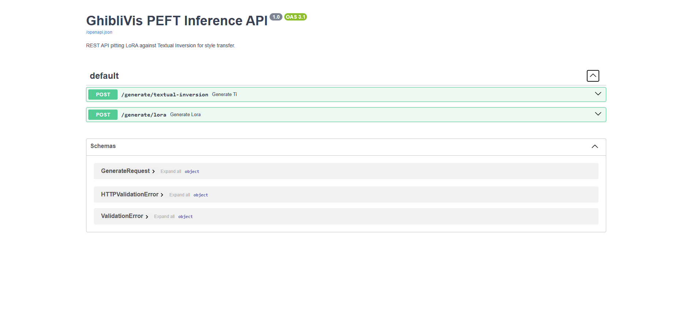
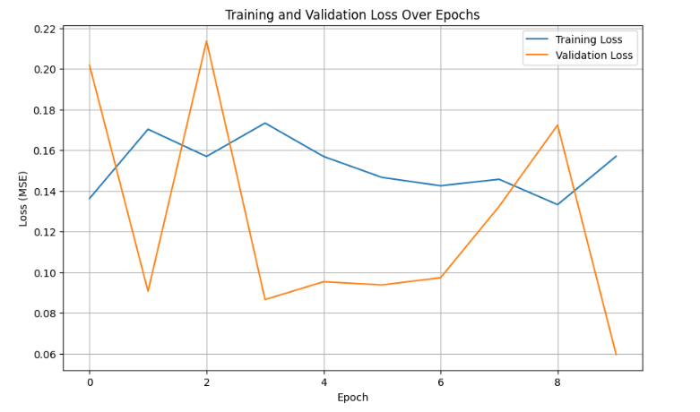
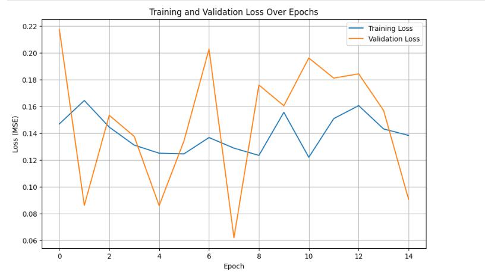

# Fine-Tuning Stable Diffusion with PEFT Methods 🎨


This repository provides a comparative analysis of **Low-Rank Adaptation (LoRA)** and **Textual Inversion (TI)** for adapting large text-to-image diffusion models for niche artistic style transfer. The project investigates the efficacy, efficiency, and precision of these two leading Parameter-Efficient Fine-Tuning (PEFT) methods when fine-tuning on a limited, custom dataset.

The research concludes that **LoRA is the more effective, precise, and robust methodology** for high-fidelity style transfer, achieving superior performance across all quantitative metrics and in a qualitative blind user study.

---
## ✨ Key Features

* **Comparative Analysis:** Implements both LoRA and Textual Inversion for a direct comparison on a "Ghibli-style" art transfer task.
* **Production-Ready Inference API:** Includes a dynamically managed FastAPI backend to serve both models efficiently without overloading VRAM.
* **Quantitative Evaluation:** Includes analysis of training efficiency, loss dynamics, and image fidelity scores.
* **Qualitative User Study:** Features the methodology and results of a 50-participant blind study assessing aesthetic appeal and style coherence.
* **Optimized Scripts:** The Textual Inversion script includes a latent pre-computation optimization for significantly faster training.
* **Complete Guides:** Step-by-step instructions for data preparation, training, and inference for both PEFT methods.

---
## 🔧 Installation & Server Setup

To get started, clone the repository, install the dependencies, and launch the web server.

1.  **Clone the repository:**
    ```bash
    git clone [https://github.com/AbdiR0099/Stable-Diffusion-PEFT-Methods.git](https://github.com/AbdiR0099/Stable-Diffusion-PEFT-Methods.git)
    cd Stable-Diffusion-PEFT-Methods
    ```

2.  **Create and activate a virtual environment (recommended):**
    ```bash
    python -m venv venv
    source venv/bin/activate  # On Windows, use `venv\Scripts\activate`
    ```

3.  **Install dependencies:**
    ```bash
    pip install -r requirements.txt
    ```

4.  **Launch the Inference API:**
    Start the FastAPI web server using Uvicorn. This will load the base Stable Diffusion pipeline into your GPU.
    ```bash
    uvicorn app:app --reload
    ```
    Once the startup is complete, open your web browser and navigate to the interactive dashboard at: **[http://127.0.0.1:8000/docs](http://127.0.0.1:8000/docs)**

---
## 🌐 Web Interface (FastAPI)

To make testing and inference seamless, this project includes a REST API that manages GPU memory state. It permanently loads the Textual Inversion embedding (which consumes zero extra VRAM) while dynamically loading and unloading the LoRA weights per request to prevent Out-Of-Memory (OOM) errors.



---
## 🚀 Usage Guides

This project contains separate, self-contained modular scripts for each PEFT method inside the `src/` directory. 

### Dataset Preparation

The dataset was curated from 115 landmark images from the Google Landmarks Dataset V2, which were then re-rendered into a "Ghibli" style using an `img2img` pipeline.

1.  **Input Format:** Create a folder for your images. For each image (`image.png`), create a corresponding text file (`image.txt`) with a descriptive caption.
2.  **Preprocessing:** The provided data pipeline (`src/data_pipeline.py`) will automatically handle image transformations:
    * **Resolution Standardization:** Resizes each image to 512x512 pixels.
    * **Centre Cropping:** Crops the image to preserve the most salient central part.
    * **High-Quality Resampling:** Uses the Lanczos filter to preserve detail.
3.  **Output:** The scripts will save processed images to a new folder and split captions into `train.txt` and `validation.txt` files.

---
### Guide to LoRA Training

LoRA adapts models by introducing small, trainable "rank decomposition" matrices into the existing layers, significantly reducing the number of trainable parameters.

* **Configuration:** Set parameters in the `LoRAConfig` class within `src/train_lora.py`.
* **Training:** Execute the script. It freezes the base Stable Diffusion model and updates **only the injected LoRA layers**.
* **Inference:** Use the `/generate/lora` endpoint on the FastAPI server to dynamically inject the adapter and generate images.

---
### Guide to Textual Inversion Training

Textual Inversion teaches a model a new concept by creating a new "word" in its vocabulary, represented by a trainable token embedding.

* **Configuration:** Set parameters in the `TIConfig` class within `src/train_ti.py`, defining your `placeholder_token` (e.g., `<ghiblivis-style>`).
* **Training:** The script freezes the **entire** Stable Diffusion model and updates **only the new token embedding**. This process is accelerated by pre-computing image latents.
* **Inference:** Use the `/generate/textual-inversion` endpoint on the FastAPI server with your `placeholder_token` in the prompt to generate images.

---
## 📊 Analysis & Results

A comparative evaluation was performed using both quantitative metrics and a qualitative user study.

### Quantitative Analysis

* **LoRA Performance:** Showed stable and efficient training over 10 epochs, with a total training time of **2 hours and 40 minutes**. The validation loss reached its lowest point in the final epoch, indicating robust generalization without overfitting.
    
* **Textual Inversion Performance:** Training was accelerated by latent caching but ran for 15 epochs, taking **3 hours and 15 minutes**. The model achieved its best validation score at Epoch 8, after which it showed clear signs of **overfitting** as validation loss consistently increased.
    

### Qualitative Analysis (50-Participant Blind User Study)

The study revealed a decisive preference for LoRA-generated images.

* **Overwhelming Preference:** **90%** of participants would choose to purchase a LoRA-generated image as artwork, compared to **0%** for Textual Inversion.
* **Style Coherence:** **80%** of participants found the LoRA images to be more stylistically similar to the original "Ghibli" images.
* **Content Preservation:** While 50% felt both models struggled to preserve landmark details, **40%** believed LoRA did a better job of maintaining the subject's identity, compared to only 10% for TI.

### Generated Image Showcase

| LoRA Generated Images                                      | Textual Inversion Generated Images                                 |
| :-------------------------------------------------------: | :----------------------------------------------------------------: |
| /BigBen.png) | /BigBen.png)         |
| /Colosseum.png) | /Colosseum.png)         |
| /Petra.png) | /Petra.png)         |
| /SydneyOperaHouse.png) | /SydneyOperaHouse.png)         |
| /BabEKhyber.png) | /BabEKhyber.png)         |


---
## ⚠️ Limitations & Future Work

The experimental setup had inconsistencies that affected a direct efficiency comparison. For a truly fair comparison, both training pipelines should be identically optimized with **xformers** and **latent caching**. This would ensure any observed differences are solely attributable to the PEFT methods themselves.

---
## 🏆 Conclusion

In every dimension of evaluation—learning stability, quantitative fidelity, and human-perceived quality—**LoRA demonstrated a clear and consistent advantage**. Its mechanism of directly modifying the UNet's attention layers provides a more powerful and robust means of capturing and reproducing a complex artistic style compared to Textual Inversion's single-vector approach.